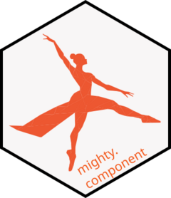

<!-- README.md is generated from README.Rmd. Please edit that file -->

```{r, include = FALSE}
knitr::opts_chunk$set(
  collapse = TRUE,
  comment = "#>",
  fig.path = "man/figures/README-",
  out.width = "100%"
)
options(mighty.component.verbosity_level = "quiet")
```

# mighty.component <a href="https://novonordisk-opensource.github.io/mighty.component"></a>

<!-- badges: start -->
[](https://github.com/NovoNordisk-OpenSource/mighty.component/actions/workflows/check_and_co.yaml)
<!-- badges: end -->

mighty.component serves as a repository of generic compute component classes used to produce ADaM scripts in the {mighty} framework.

## Installation

You can install the development version of `mighty.component` from GitHub with:

```{r, eval=FALSE}
pak::pak("NovoNordisk-OpenSource/mighty.component")
```

## Usage

Get a component by name from a repo. Repos can be local directories,
`github::owner/repo/subdir@ref` or `url::https://...`. With several repos,
they are searched in order and the first match is used.

```{r get}
library(mighty.component)

repo <- system.file("examples", package = "mighty.component")
ady <- get_component("ady", repos = repo)
ady
```

Render it with study-specific parameters:

```{r render}
ady$render(domain = "ADAE", variable = "ASTDY", date = "ASTDT")
```

Rendered components can be evaluated with `$eval()`, written to a script
with `$stream()`, and unit tested with `get_test_component()`.
See `vignette("mighty-component")` for details.
